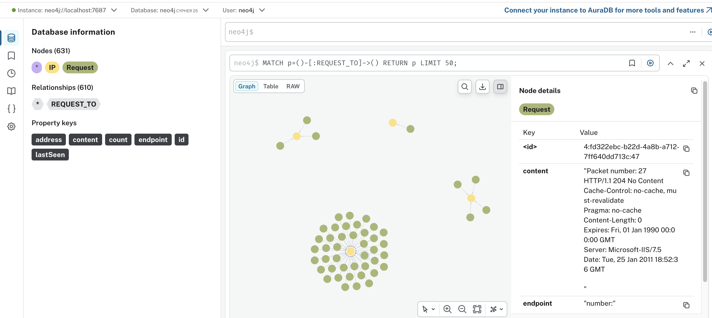

# noauth-map

A command-line tool for analyzing HTTP traffic captured in PCAP files. It identifies unauthenticated HTTP requests and maps the relationships between IPs and endpoints into a Neo4j graph, making it easy to visualize and investigate exposed attack surfaces on monitored networks.

---

## How it works

1. Reads a `.pcap` file and extracts all TCP packets containing HTTP payloads.
2. Filters out requests with authentication headers (`Authorization`, `Cookie`, `x-api-key`, `x-auth-token`, `Proxy-Authorization`), keeping only **unauthenticated** ones.
3. Extracts the `Host` header from each request and counts access frequency per host.
4. Persists results in Neo4j as a graph:
   - `IP` node — destination host (with request count and last-seen timestamp)
   - `Request` node — request payload (identified by SHA-256 hash of its content)
   - `REQUEST_TO` edge — links each request to its destination

Results can be explored visually in the Neo4j Browser at `http://localhost:7474`.

---

## Requirements

- [Go](https://go.dev/dl/) 1.22+
- [Neo4j](https://neo4j.com/download/) Community or Enterprise (running locally on port 7687)
- `libpcap` installed (`libpcap-dev` on Debian/Ubuntu, `libpcap` on Arch/Fedora)

---

## Installation

```bash
git clone https://github.com/0xtonyr/noauth-map
cd noauth-map
go build -o noauth-map
```

---

## Usage

**1. Start Neo4j**

```bash
sudo neo4j start
```

**2. Set the Neo4j password via environment variable**

```bash
export NEO4J_PASSWORD=your_password
```

> The `-neo4jpassword` flag is still available as a fallback, but it exposes credentials in the process list (`ps aux`). The environment variable is preferred.

**3. Run the analysis**

```bash
./noauth-map <file.pcap>
```

Example using the included sample:

```bash
./noauth-map smallFlows.pcap
```

Expected output:

```
[+] Parsing smallFlows.pcap file
[+] Scan completed in 0.031s
[+] Starting Neo4j connection test...
[+] Neo4j connection test succeeded.
[+] IPs successfully inserted into Neo4j.
[+] Starting to insert requests and link them to IPs...
[+] Requests successfully inserted and linked to IPs in Neo4j.
```

**4. Explore the results**

Open `http://localhost:7474` in your browser and query the graph with Cypher:



```cypher
// All discovered hosts, sorted by request count
MATCH (ip:IP) RETURN ip ORDER BY ip.count DESC

// Requests sent to a specific host
MATCH (req:Request)-[:REQUEST_TO]->(ip:IP {address: "192.168.1.1"})
RETURN req.endpoint, req.content

// Full graph overview
MATCH (req:Request)-[:REQUEST_TO]->(ip:IP)
RETURN req, ip
```

---

## Output file

In addition to Neo4j, the tool generates a text file `<pcap-name>-analysis.txt` containing all filtered requests grouped by packet. This file is used as an intermediate step during processing.

---

## Responsible use

> **This tool is intended exclusively for security professionals operating in authorized contexts.**

The use of this tool against networks, systems, or infrastructure without explicit written authorization from the owner is **illegal** and may violate computer fraud and abuse laws in your jurisdiction.

Only use this tool in:

- Your own environments (labs, homelabs, virtual machines)
- Networks and systems for which you hold written authorization
- Pentest engagements with a defined scope and signed contract
- CTF (Capture The Flag) competitions
- Academic research with institutional approval

The author is not responsible for any misuse of this tool. **Use responsibly.**
